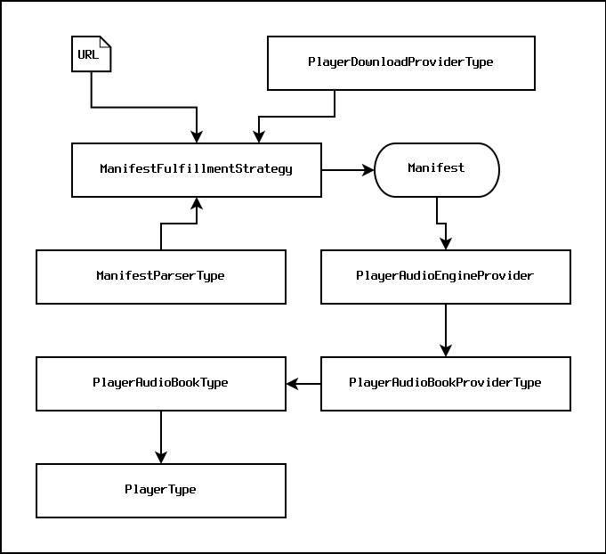

audiobook-android
===

[](https://github.com/ThePalaceProject/android-audiobook/actions?query=workflow%3A%22Android+CI+%28Authenticated%29%22)
[](http://search.maven.org/#search%7Cga%7C1%7Cg%3A%22org.thepalaceproject.audiobook%22)
[](https://s01.oss.sonatype.org/content/repositories/snapshots/org.thepalaceproject.audiobook/)

A complete audiobook playing solution for Android.

### Features

* Highly extensible _manifest parser_ API that can consume manifest formats from a wide range
  of audiobook distributors.
* Extensible _license-checking_ API that provides support for different content protection
  schemes.
* [Media3](https://developer.android.com/media/media3)-based player that can play unprotected
  and [LCP](https://www.edrlab.org/readium-lcp/)-protected audiobooks.
* [Audioengine](https://findaway.com/)-based player that can play Findaway audiobooks (with
  an appropriate license).
* APIs for downloading and parsing manifests, and downloading and parsing LCP license files.
* A basic provided audiobook player UI using stateless fragments that should be immune to bugs
  caused by Android's fundamentally broken lifecycle system.

### Compilation

Make sure you clone this repository with `git clone --recursive`. 
If you forgot to use `--recursive`, then execute:

```
$ git submodule init
$ git submodule update --remote --recursive
```

```
$ ./gradlew clean assembleDebug test publish
```

### Usage

#### Overview

The `audiobook-android` package provides a layered API. Most applications will want to use the
highest-level `PlayerModel` object in the [org.librarysimplified.audiobook.views](org.librarysimplified.audiobook.views)
module along with the stateless fragments the package provides.

#### High-Level Steps

* In your application's activity, subscribe to `PlayerModel` events in the `onStart()` method.
* In response to `PlayerViewCommand` and `PlayerModelState` events, detach and attach `Player*` 
  fragments from/to your activity. The provided `Player*` fragments are completely stateless and 
  so can be freely destroyed and recreated without involving the fundamentally broken-by-design 
  Android "fragment backstack".
* In response to `PlayerEventCreateBookmark` and `PlayerEventDeleteBookmark` events, create and
  delete bookmarks in your application's persistent store as needed.
* Call `PlayerModel.downloadParseAndCheckLCPLicense()` or
  `PlayerModel.downloadParseAndCheckManifest()` to asynchronously download and parse an LCP license 
  and/or a _manifest_ from a given URL. This will cause the `PlayerModel` to publish various
  status events that can be displayed in some sort of _in-progress_ UI.
* Call `PlayerModel.openPlayerForManifest()` with a manifest to open an appropriate audio player
  and start playing the book.

The included [org.librarysimplified.audiobook.demo](org.librarysimplified.audiobook.demo) 
application provides a simple single-activity application that correctly uses the `PlayerModel`
API.

### Implementation

#### Core

At a basic level, the package works with the following entities:



Given a URL that delivers a manifest, an implementation of the `ManifestFulfillmentStrategyType`
downloads and parses a manifest. There are many implementations of the
`ManifestFulfillmentStrategyType` interface that each encapsulate the logic required to get
a manifest from various different audiobook distributors. The `ManifestFulfillmentStrategyType`
implementations typically require a `ManifestParserType` and a `PlayerDownloadProviderType` to
handle parsing and downloading of manifests, respectively.

The output of a `ManifestFulfillmentStrategyType` is a `PlayerManifest`. Given a `PlayerManifest`,
it's then necessary to find a `PlayerAudioEngineProviderType` that is capable of handling the
given manifest. Whether a particular `PlayerAudioEngineProviderType` is capable of handling a
particular manifest tends to depend on whether the engine provider supports the content
protection scheme declared in the manifest. For example, the plain 
[org.librarysimplified.audiobook.media3](org.librarysimplified.audiobook.media3) engine cannot
play Findaway audiobooks. Conversely, the 
[org.librarysimplified.audiobook.audioengine](org.librarysimplified.audiobook.audioengine)
engine cannot play LCP-protected books. The `PlayerAudioEngines` class can, given a manifest,
search for appropriate audio engines.

When a suitable audio engine has been found, the audio engine is called upon to produce a
`PlayerAudioBookType`, representing an instance of an audio book. The `PlayerAudioBookType`
interface can be used to download chapters of a book, returned a fully parsed table of contents,
and other services.

A `PlayerAudioBookType` value can be used to create a `PlayerType` value. The `PlayerType` value
is responsible for the actual audio playback for books, and exposes various controls such as
playing, pausing, skipping chapters, seeking, and etc.

#### PlayerModel

The `PlayerModel` object provides an extremely simplified API over the top of the above objects
and allows for avoiding most if not all of the lifecycle-related issues and crashes that plague
most Android applications. The UI fragments included with the package work in terms of this
`PlayerModel` object.

#### UI

The `audiobook-android` package provides a set of stateless `Fragments` that are used to
provide a basic user interface. Applications are expected to instantiate the various subclasses
of the `PlayerBaseFragment` as needed. As mentioned, the fragments are stateless and therefore
do not require any kind of fragile, error-prone Android backstack management.

#### LCP

The `audiobook-android` package provides extensive support for [LCP](https://www.edrlab.org/readium-lcp/).

LCP audiobooks are distributed in _packaged_. A _packaged_ audiobook is a zip file containing the
unencrypted _manifest_ and the encrypted audio files that make up the chapters of the book. A
severe downside to _packaged_ audiobooks is that, lacking more advanced software support, the
entire book must be downloaded before the user can listen to it. The `audiobook-android` package
delegates streaming functionality to the [Readium 2](https://readium.org/technical/r2-toc/)
package, and is capable of streaming LCP audiobooks without having to completely download them.
Streaming is optional, and the package can either download the entire book and play it from
a local file, or stream the book from a remote server.

For downloads, the following steps are taken:

  * An `.lcpl` LCP license file is provided to the `audiobook-android` API.
  * The `.lcpl` LCP license file is parsed, and a link is extracted to the publication `.zip` file
    on the remote server.
  * The publication `.zip` file is downloaded.
  * The manifest for the audiobook is extracted from the `.zip` file by reading the
    `manifest.json` zip entry.
  * The `.lcpl` LCP license file is inserted into the `.zip` file.
  * The manifest and the `.zip` file are passed to the audiobook player, which then begins
    playback as normal.

For streaming, the following steps are taken:

  * An `.lcpl` LCP license file is provided to the `audiobook-android` API.
  * The `.lcpl` LCP license file is parsed, and a link is extracted to the publication `.zip` file
    on the remote server.
  * A Readium 2 `AssetRetriever` is instantiated using the link to the remote publication `.zip` file.
  * The `AssetRetriever` is used to extract the `manifest.json` data from the `.zip` file by
    streaming just the relevant parts of the `.zip` file from the remote server.
  * The `.lcpl` LCP license file and the manifest are passed to the audiobook player, which then 
    begins playback as normal. Book chapter audio is streamed from the remote server in the same
    manner as the initial manifest file.
